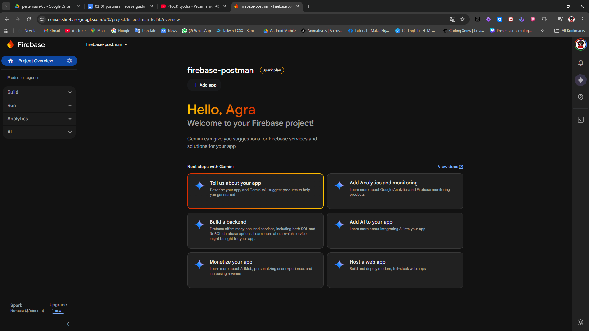

# 📧 Firebase Email Verification dengan Postman

Dokumentasi ini menjelaskan langkah-langkah melakukan **setup verifikasi email menggunakan Firebase Authentication** serta melakukan pengujian API menggunakan **Postman**.

Metode ini digunakan untuk memastikan bahwa alur autentikasi Firebase berjalan dengan benar sebelum implementasi pada Flutter.

---

# 📑 Table of Contents

- [1. Setup Firebase Project](#1-setup-firebase-project)
- [2. Enable Authentication](#2-enable-authentication)
- [3. Mendapatkan Firebase API Key](#3-mendapatkan-firebase-api-key)
- [4. Registrasi User via Postman](#4-registrasi-user-via-postman)
- [5. Mengirim Email Verification](#5-mengirim-email-verification)
- [6. Verifikasi Email](#6-verifikasi-email)
- [7. Testing Login Setelah Verifikasi](#7-testing-login-setelah-verifikasi)

---

# 1. Setup Firebase Project

Pertama kita perlu membuat project baru di Firebase Console.

1. Buka halaman:
https://console.firebase.google.com

2. Klik **Add Project**

3. Masukkan nama project.

4. Klik **Continue** hingga project selesai dibuat.

---

### Tampilan pembuatan project

---

Setelah project berhasil dibuat, kita akan diarahkan ke dashboard Firebase.

---