# 📧 Firebase Email Verification dengan Postman

Dokumentasi ini menjelaskan langkah-langkah melakukan **setup verifikasi email menggunakan Firebase Authentication** serta melakukan pengujian API menggunakan **Postman**.

Metode ini digunakan untuk memastikan bahwa alur autentikasi Firebase berjalan dengan benar sebelum implementasi pada Flutter.

---

# 📑 Table of Contents

- [1. Setup Firebase Project](#1-setup-firebase-project)
- [2. Enable Authentication](#2-enable-authentication)
- [3. Mendapatkan Firebase API Key](#3-mendapatkan-firebase-api-key)
- [4. Registrasi User via Postman](#4-registrasi-user-via-postman)
- [5. Mengirim Email Verification](#5-mengirim-email-verification)
- [6. Verifikasi Email](#6-verifikasi-email)
- [7. Testing Login Setelah Verifikasi](#7-testing-login-setelah-verifikasi)

---

# 1. Setup Firebase Project

Pertama kita perlu membuat project baru di Firebase Console.

1. Buka halaman:
https://console.firebase.google.com

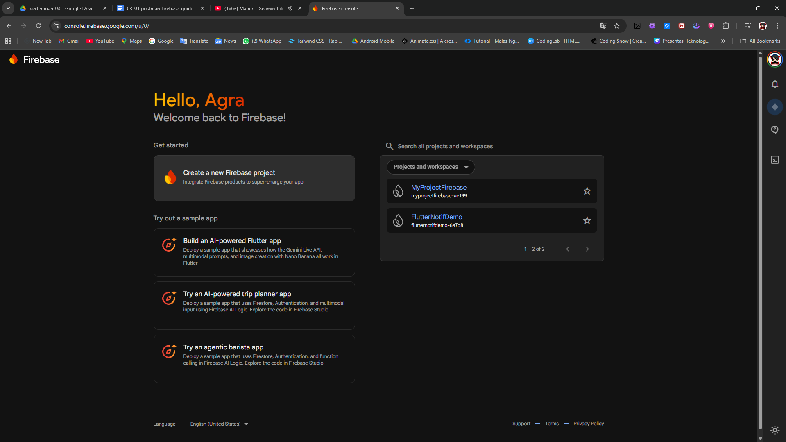

2. Klik **Add Project**

3. Masukkan nama project.

4. Klik **Continue** hingga project selesai dibuat.

---

### Tampilan pembuatan project

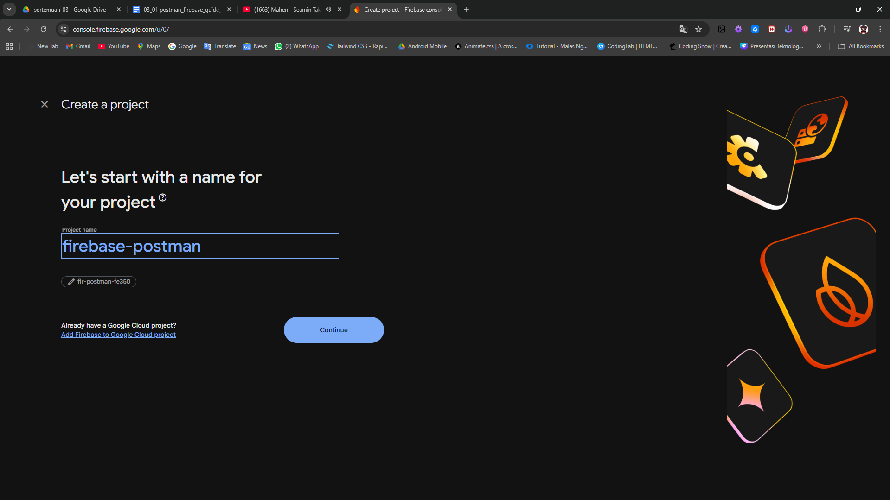

---

Setelah project berhasil dibuat, kita akan diarahkan ke dashboard Firebase.

### Dashboard Firebase Project

---

# 2. Enable Authentication

Selanjutnya kita perlu mengaktifkan fitur **Authentication**.

Langkah-langkahnya:

1. Pada sidebar Firebase klik **Build**
2. Pilih menu **Authentication**
3. Klik **Get Started**

---

### Menu Authentication

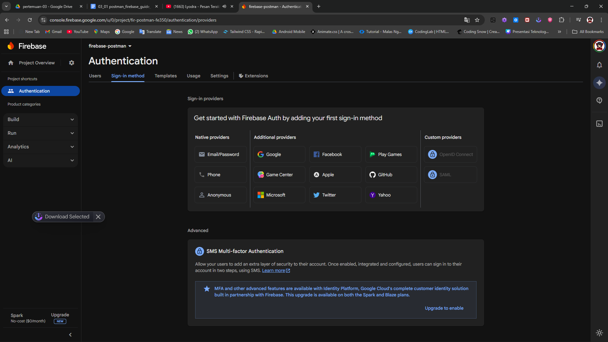

---

Setelah itu kita harus mengaktifkan metode login **Email/Password** dan **Google**.

Langkahnya:

1. Masuk ke tab **Sign-in Method**
2. Klik **Email/Password**
3. Aktifkan **Enable**
4. Klik **Save**
4. Setelah itu Klik **Add New Provider** dan Pilih Menu/Logo **Google**

---

### Enable Email Password

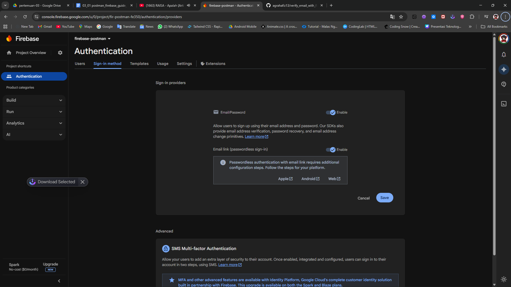

### Enable Google

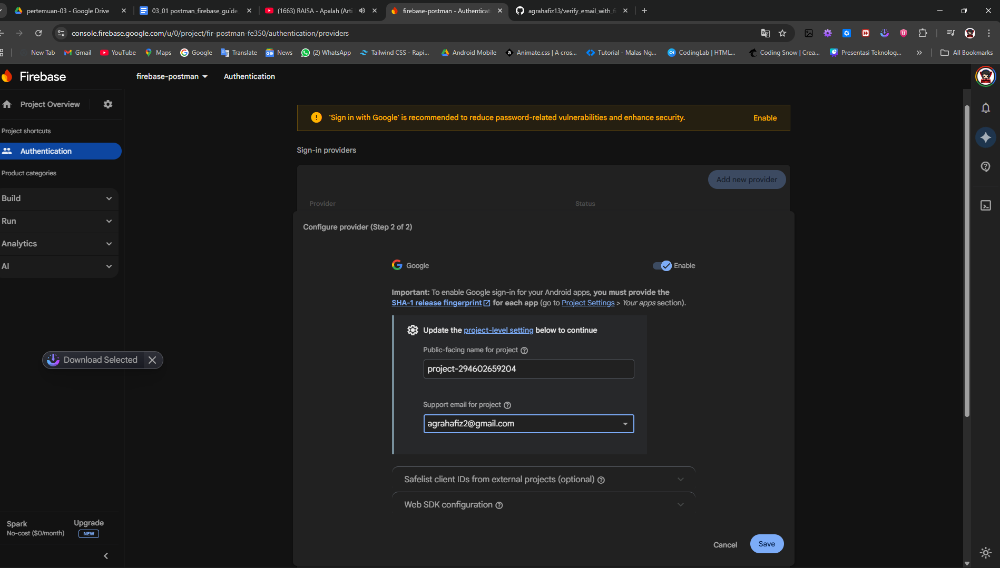

### Pastikan Authentication Semua Sudah Enable

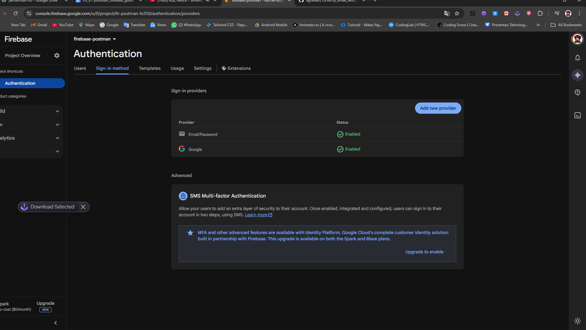

---

# 3. Mendapatkan Firebase API Key

Untuk menggunakan Firebase API melalui Postman, kita memerlukan **API Key**.

Langkah-langkah:

1. Klik **Project Settings**
2. Masuk ke tab **General**
3. Scroll ke bagian **Your Apps**

---

### Firebase Project Settings

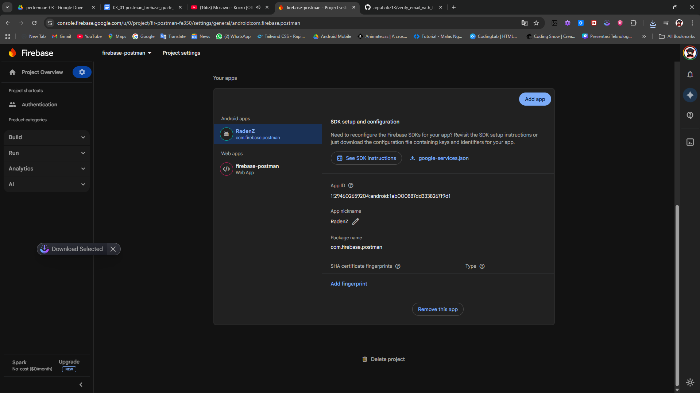

---

Kemudian salin atau simpan nilai:

API Key ini akan digunakan pada request Postman.

---

# 4. Login ke Postman

Setelah mendapatkan **Firebase API Key**, langkah selanjutnya adalah membuka aplikasi **Postman** untuk melakukan pengujian Firebase REST API.

Langkah-langkah:

1. Buka aplikasi **Postman**
2. Jika belum memiliki akun, lakukan **Sign Up**
3. Jika sudah memiliki akun, lakukan **Login**
4. Setelah berhasil login, Anda akan masuk ke halaman dashboard Postman

---

### Halaman Login Postman

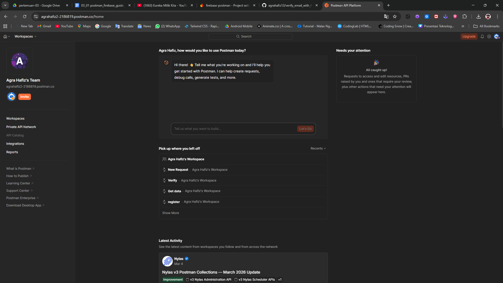

---

# 5. Membuat Pengujian Baru di Postman 

Setelah berhasil masuk ke Postman, kita akan membuat **Pengujian** untuk melakukan test dengan API Firebase.

Langkah-langkah:

1. Buat Folder di **Collection** dan **Environments**
2. Setelah itu klik **Environments**
3. Create New -> Lalu ubah nama menjadi "My Environment".
4. Isi variabel dan value-nya seperti gambar di bawah ini:

---

### Setup Testing

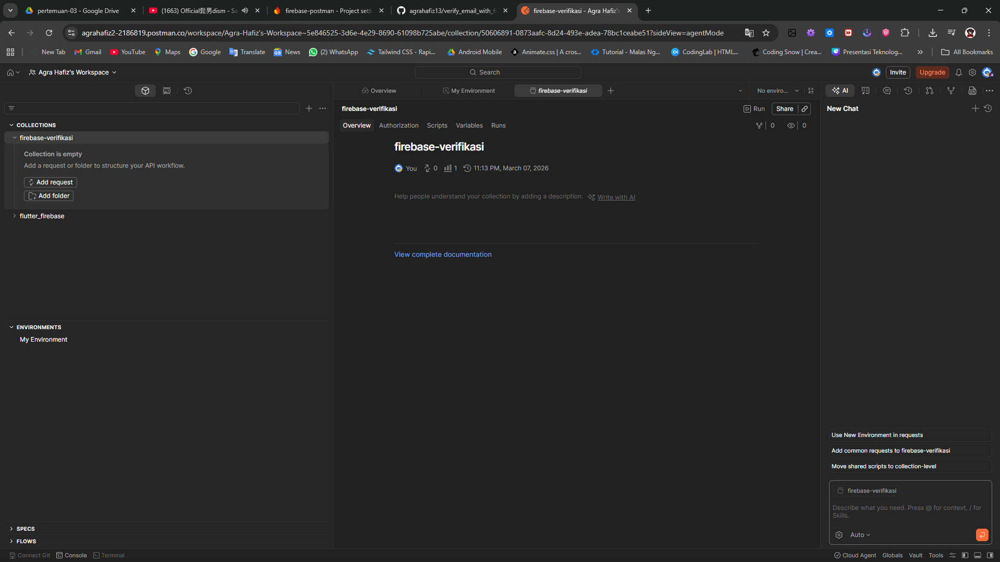

### Setup Environments

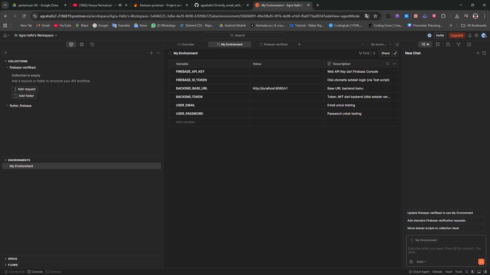

---

# 6. Registrasi User menggunakan Firebase REST API

Pada tahap ini kita akan melakukan **registrasi user baru menggunakan Firebase Authentication API**.

Endpoint yang digunakan adalah:

POST https://identitytoolkit.googleapis.com/v1/accounts:signUp?key={
{FIREBASE_API_KEY}}

Ganti bagian **FIREBASE_API_KEY** dengan API Key yang didapat dari Firebase.

---

### Setup Request di Postman

Langkah-langkah:

1. Pilih **Method POST**
2. Masukkan URL endpoint Firebase
3. Masuk Ke tab **Headers** untuk test semua Firebase REST API
4. Masuk ke tab **Body**
5. Pilih **Raw**
6. Pilih format **JSON**
7. Pilih tab **Script** agar idToken bisa tersimpan otomatis
---

### Request Register User

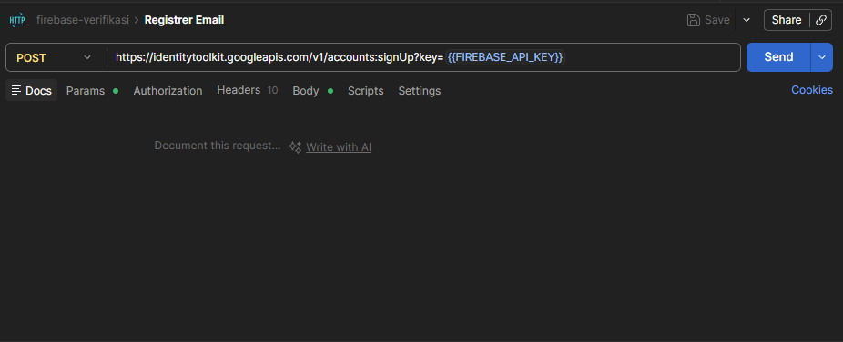

---

### Headers Request

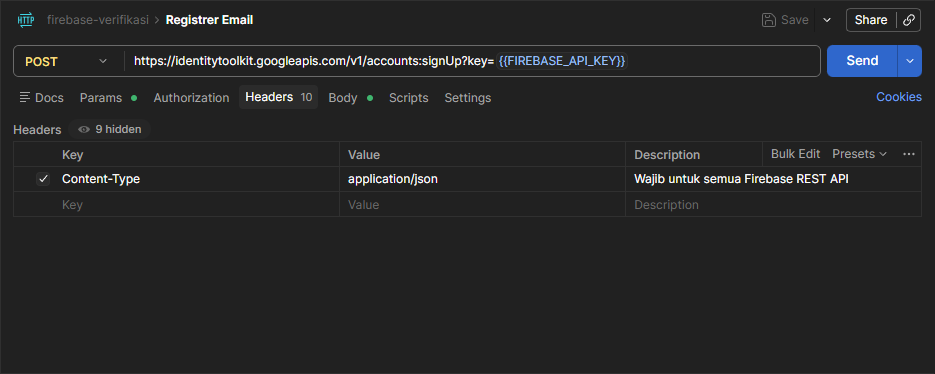

---

### Body Request

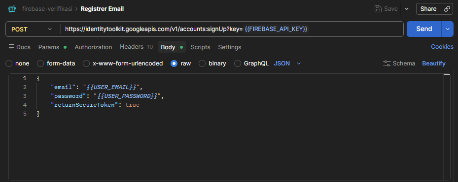

---

### Script

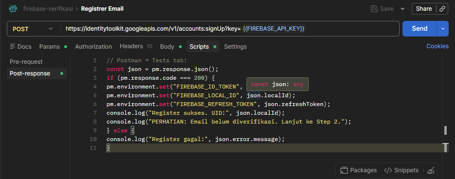

---